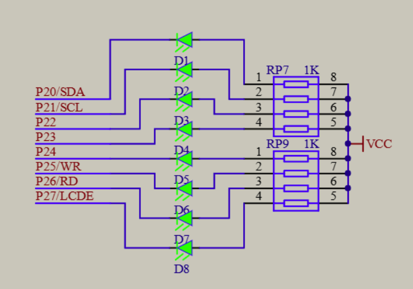
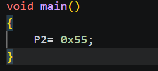
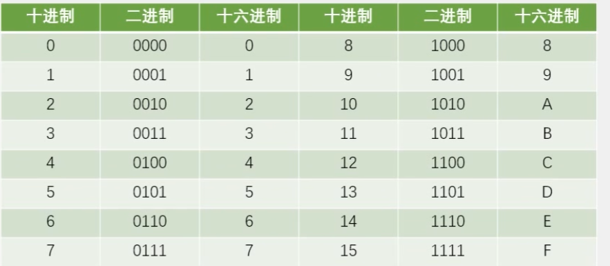
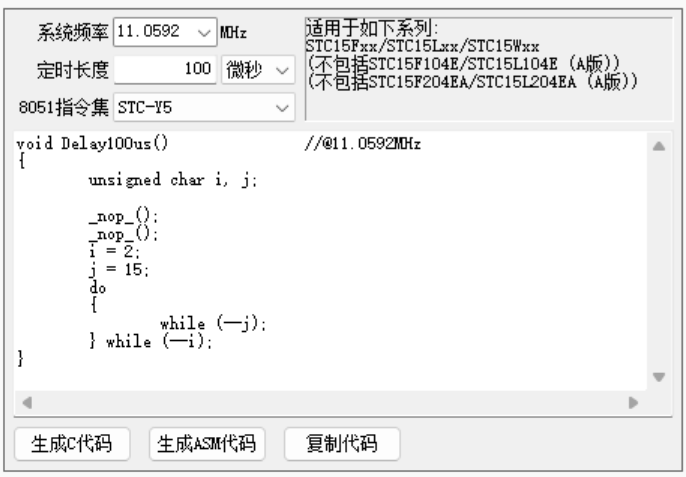
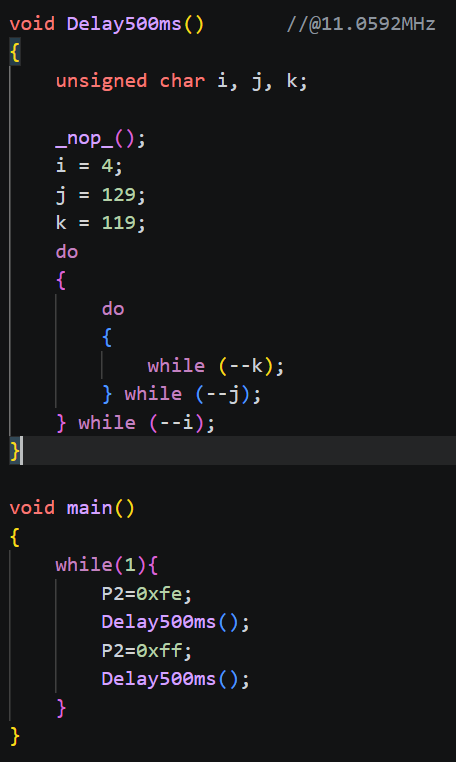
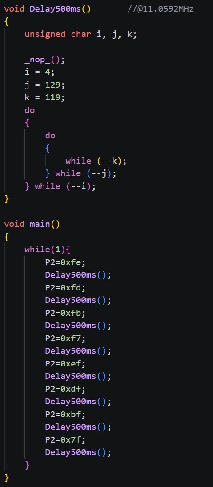
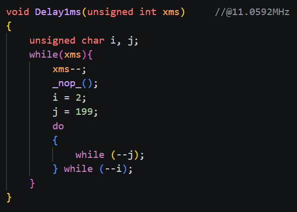

# day01

今天的内容是关于51单片机led灯初步控制的学习

## 2-1 LED灯控制原理

[源码跳转](code\day01\2-1\main.c)

如图所示led灯主要通过P2口控制，所以控制时只需要控制P2口的电平即可，需要注意的是VCC为固定高电平所以P2口的电平为低电平时led灯才会亮起，控制电平的方式如下图所示

这里解释一下代码中的P2自然对应P2口，0x55是16进制对应二进制的01010101，每一位控制对应的电平高低，那么就是D2468这四个灯会亮

这样就能够简单控制led灯的亮灭

## 2-2控制led灯闪烁

[源码跳转](code\day01\2-2\main.c)

第二步控制led灯的闪烁

这里需要使用软件延时计算器来实现闪烁效果

计算出延时时间后，需要在代码中添加延时函数，如下图所示

led灯亮起后再灭掉即可，如果没有延时函数，led灯会一直亮起并不是没有闪烁效果，而是闪烁速度过快人眼无法识别

## 2-3 led灯流水效果

[源码跳转](code\day01\2-3\main.c)

接下来写led灯流水效果

如法炮制就不解释了

## 2-4 动态延时

[源码跳转](code\day01\2-4\main.c)

最后修改一下关于延时计算器的代码，如果每次延时时间不同，那么需要频繁去软件中复获取延时代码，所以这里修改一下使其能实现动态延时

先拿到1ms的延时代码然后写一个循环函数将延时代码剪切进去，定义unsigned int xms为延时时间，每执行一次循环，xms就减1，直到xms为0，延时函数就执行完成，虽然这种方法会破坏精准度，但其实本就不精准也就无需在意了