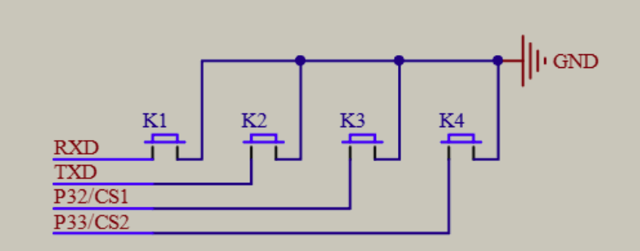
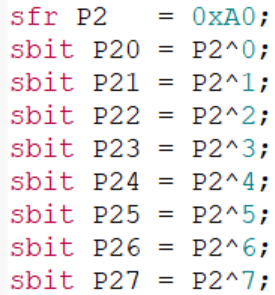
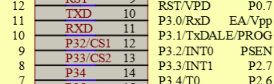
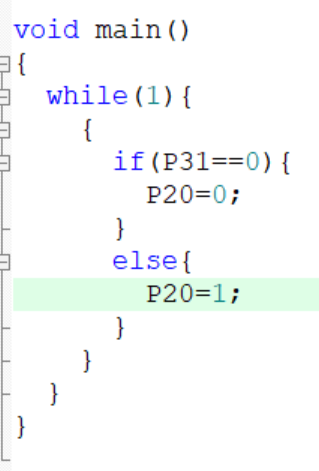
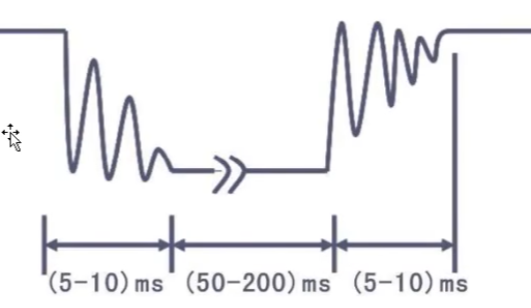
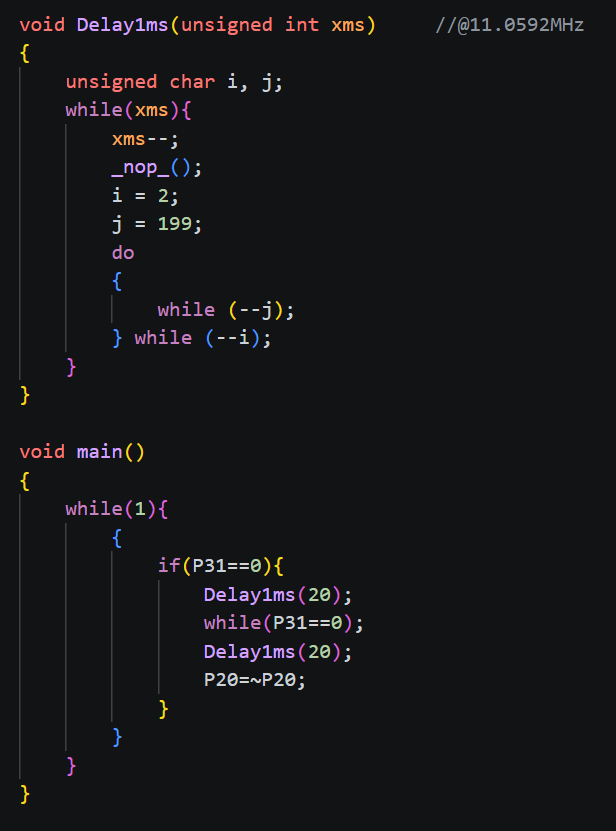
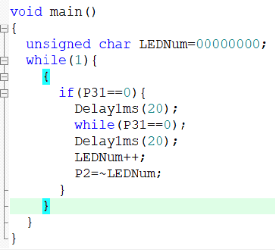
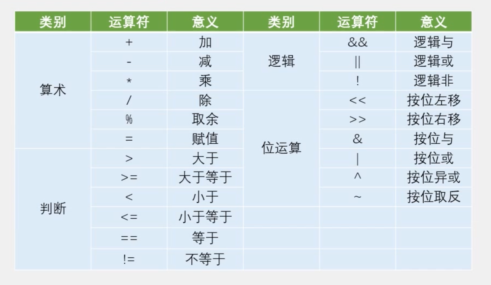
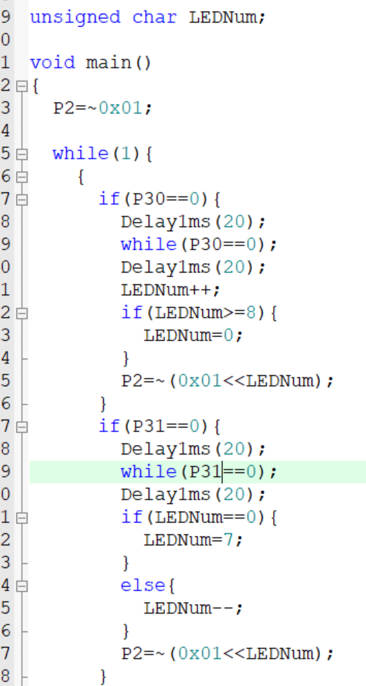

# day02

今天的内容是独立按键控制led灯

## 3-1 独立按键控制led灯亮灭

[源码跳转](code\day02\3-1\main.c)

这里先来看一下独立按键的原理图，可以看到独立按键一端接的是GND，另一端是P3口，MCU通过检测P3口的电平来判断按键是否被按下，按键按下时接通GND，P3口变为低电平，松开变回高电平

这里再来讲一下代码对各个电路口的控制，打开头文件STC89C5xRC.H，以P2口为例，单独P2需要包含8个位去控制电平高低，如果只要控制单个电平可以使用P20，P21，P22等来实现，同理P3口也一样

这里可以看出控制K1的是P31，现在写一下代码

if(P31==0)判断P31是否为低电平，如果是低电平则说明按键被按下，那就P20=0使D1灯亮起，否则D1灯灭

## 3-2 独立按键控制led灯状态

[源码跳转](code\day02\3-2\main.c)

按键按下时会有一个抖动过程，需要在代码中添加延时函数来处理，代码中第一个Delay1ms(20)消除按下抖动，while(P31==0)是等待按键松开，第二个Delay1ms(20)消除松开抖动，P20=~P20切换led灯状态，~是取反操作符，将P20的电平取反再赋值给P20

## 3-3 独立按键控制led灯显示二进制

[源码跳转](code\day02\3-3\main.c)

要使led灯显示二进制数，先要实现二进制加法，所以定义LEDNum为00000000，做LEDNum++，每次按下按键，LEDNum会增加1，对应二进制数的增加，这样表达出的是亮的led灯对应二进制数的1，灭的led灯对应二进制数的0，但led的亮灭电平与其相反，所以再做取反赋值给P2即可实现led灯显示二进制

## 3-4 独立按键控制LED灯移位

[源码跳转](code\day02\3-4\main.c)

通过<<这个位移操作符，实现led灯的移位，这里定义LEDNum为全局变量，右移即是LEDNum++，需要注意当LEDNum=8时需要回到0，否则会超出范围所以用if判断来处理，左移操作同理