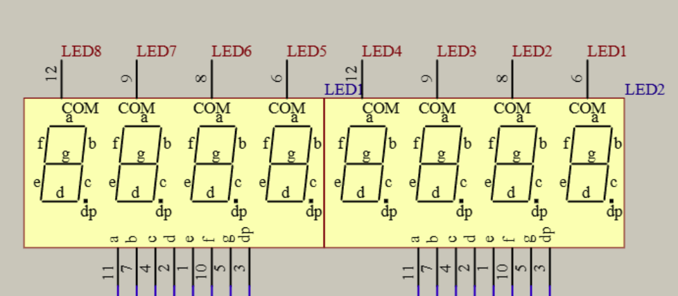
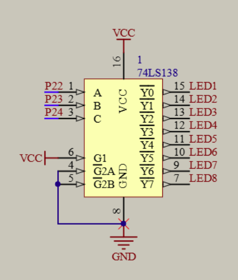
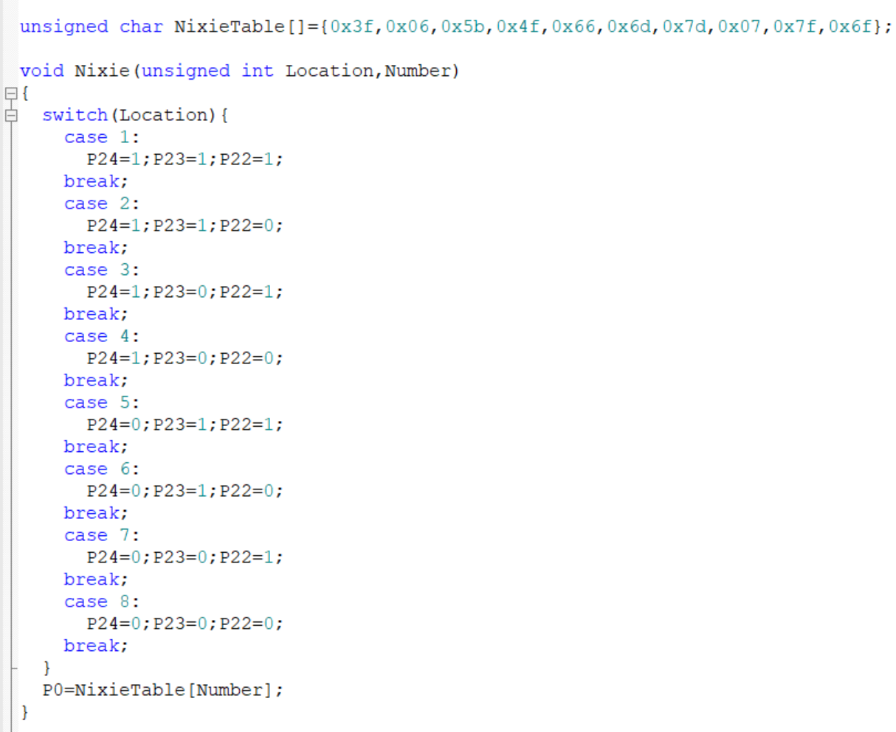
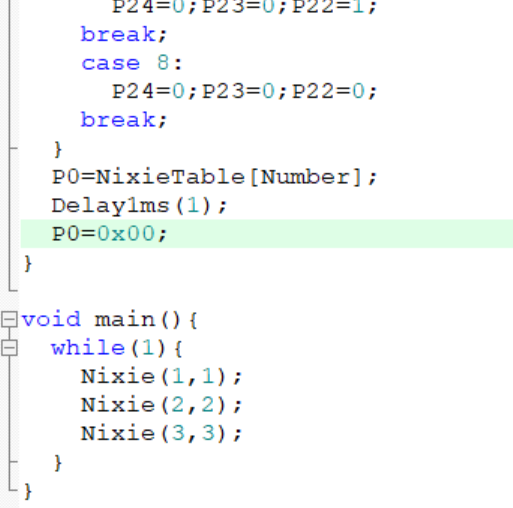

# day03

今天的内容是数码管显示

## 4-1 静态数码管显示

先来看一下数码管的电路图，每个数码管都有一个共阴极，想要数码管亮只要将共阴极接地即可，阳码对应的是数码管显示的数字，再看一下138译码器的电路图，3位二进制刚好可以对应8个数码管显示状态，下面写一下代码

首先是定义的NixieTable[]数组，这个是对应的数码管显示的数字，然后是函数Nixie，有两个形参Location和Number，Location是显示第几个数码管，Number是显示的数字，用switch语句来分别传入138译码器的输入端，最后将NixieTable[Number]赋值给P0，实现数码管的显示

## 4-2 动态数码管显示

由于数码管只能显示一位数字，但由于执行速度快，所以可以快速切换来实现多个数字显示，代码中Delay1ms(1);P0=0x00;是为了消影防止数码管显示时的闪烁，这样就可以实现动态数码管显示