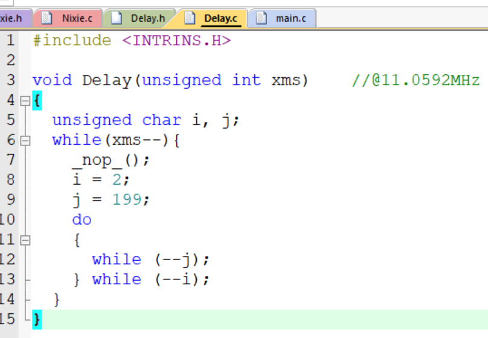
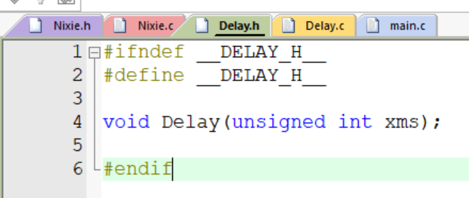
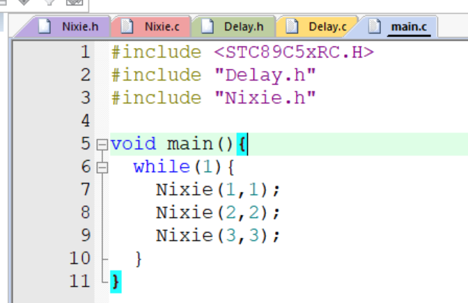

# day04

今天的内容是模块化管理和LCD1602调试工具

## 5-1 模块化管理

模块化管理主要是c语言的内容，主要是将高频代码模块化，比如之前写的Delay延时函数、Nixie数码管显示函数，将其封装成函数，方便在其他地方调用。

首先将Delay函数写入Delay.c文件中，然后在Delay.h文件中定义Delay函数，最后在main.c文件中调用Delay函数。Nixie函数的模块化同理，这里就不再赘述。需要注意的是Nixie函数中使用了Delay函数需要在Nixie.c文件中调用Delay.h文件，否则会报错。

## 5-2 LCD1602调试工具

LCD1602主要就是学习如何用LCD1602来显示信息，封装的函数直接用视频up提供的，只学习了如何使用这些函数。