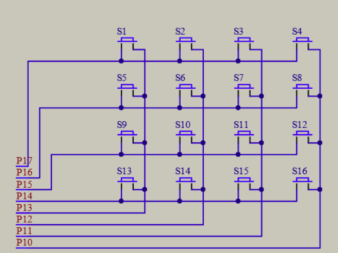
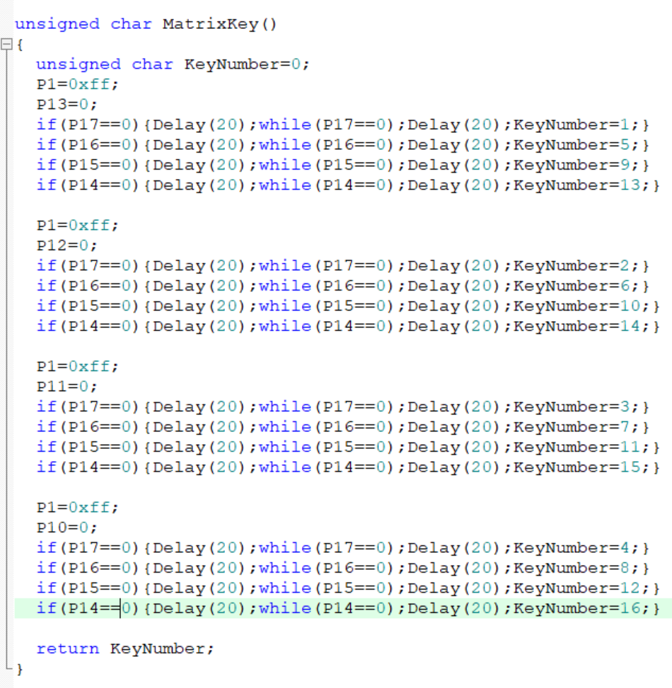
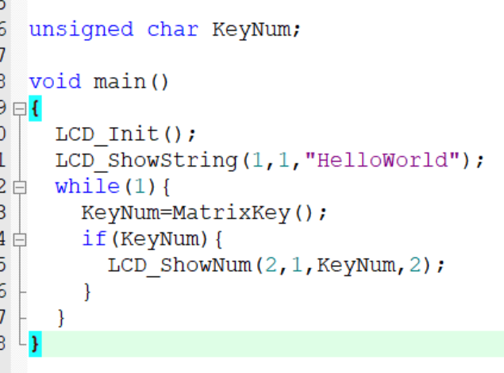
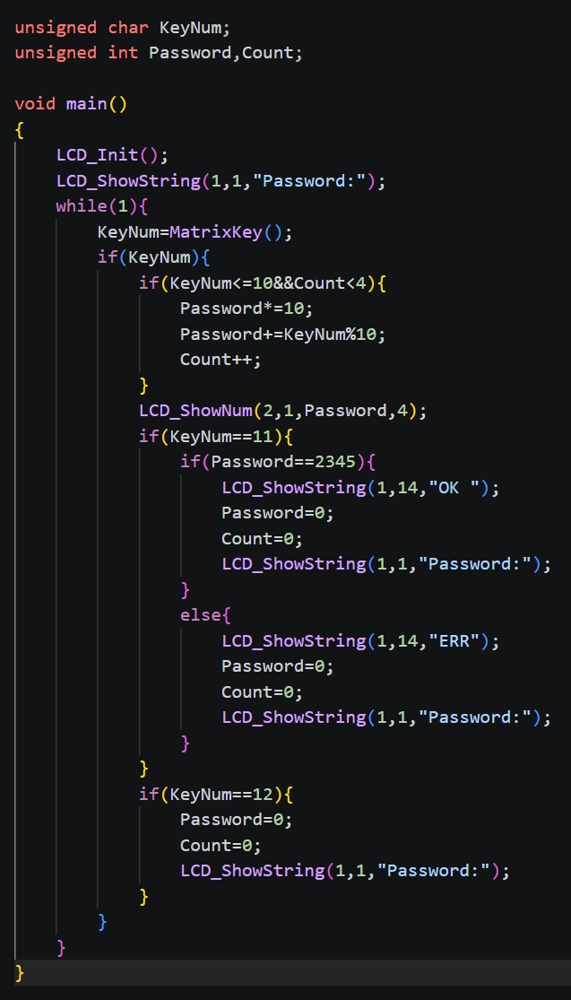

# day05

今天的内容是矩阵键盘的应用

## 6-1 矩阵键盘的应用

[源码跳转](code\day05\6-1\main.c)

矩阵键盘有16个按键以4*4的矩阵排列，从电路图可以得知16个按键用8个i/o口控制，分别对应4*4的矩阵的4行和4列，接下来来写代码

通过检测控制每个按键的两个i/o口来确定哪个按键被按下，然后将该按键序号赋值给变量，再用LCD1602显示即可

## 6-2 矩阵键盘密码锁

[源码跳转](code\day05\6-2\main.c)

这个简单来说就是用c语言结合之前的代码写一个密码锁的逻辑，1到10用于输入密码，10表示0，11用于确认键，12用于撤销键，首先是输入密码，如果KeyNum是1到10且Count<=4，就先将Password乘以10，再将该KeyNum%10加上Password，Count++用于记录密码位数，如果KeyNum是11，就判断Password是否等于2345，如果等于2345，就显示OK，否则显示ERR，如果KeyNum是12，就将Password和Count重置为0