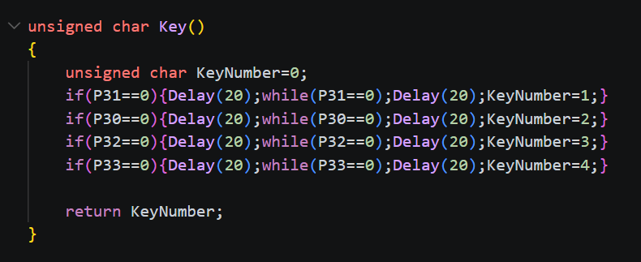
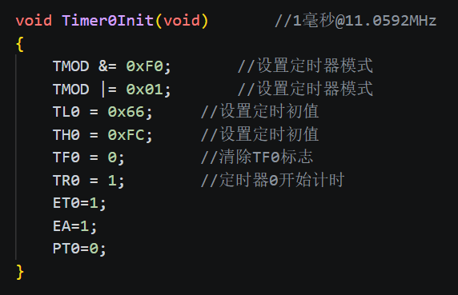
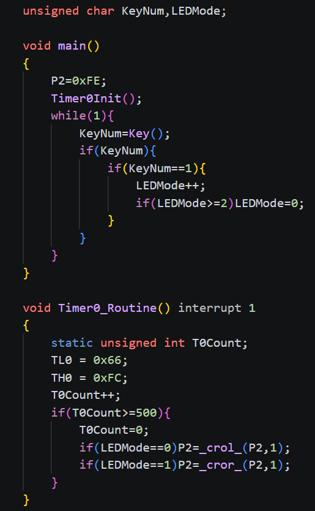
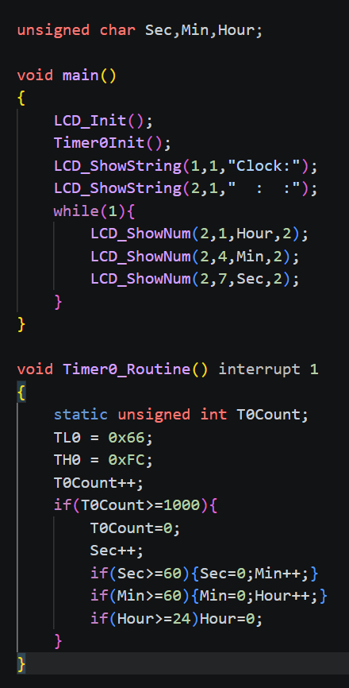

# day06

今天学习的是定时器的内容

## 7-1 运用定时器实现按键控制LED流水灯模式

[源码跳转](code\day06\7-1\main.c)

首先来讲一下定时器的大致原理，每次接收到时钟脉冲就会计数，一次就是一微秒，根据这个原理来计数或定时，但仅仅是定时是不够的，还需要中断系统，中断系统的原理是暂停当前程序的执行转而去执行优先级更高的程序，当这个程序执行完后再恢复原有程序的执行，而触发中断系统的就是定时器，这里按键控制LED流水灯模式就是用定时器来实现LED流水灯模式，主程序就去执行检测按键状态接下来写一下代码

首先是模块化的按键，然后是1毫秒的定时器模块化，定时器的代码可以去烧录软件中复制，最后来看一下主体代码，首先设置led灯然后初始化定时器，如上所述主线程是检测按键状态就是如果按了按键就LEDMode++来切换流水灯模式，定时函数里面我们写如果LEDMode为0就左移led灯，为1就右移，这样就实现了定时器实现按键控制LED流水灯模式

## 7-2 定时器闹钟

[源码跳转](code\day06\7-2\main.c)

定时器闹钟的设计思路就是主线程用于LCD显示时间，定时器用于更新时间，需要注意的是当定时器触发时需要再次赋初值，否则下次定时时间就不是1毫秒了