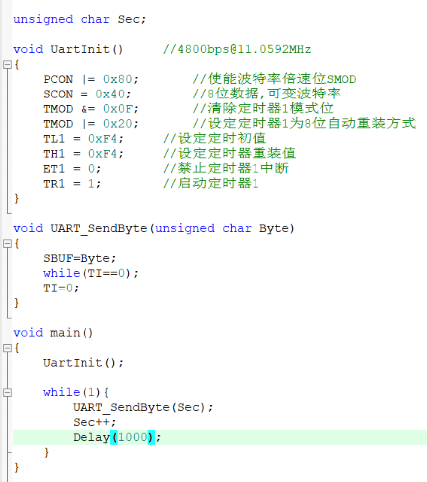
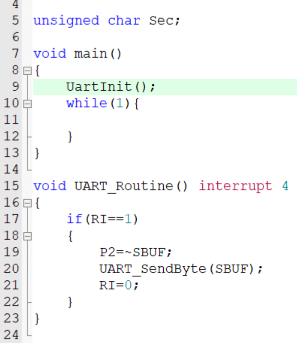

# day07

今天学习的是串口通信

## 8-1 串口向电脑发送数据

[源码跳转](code\day07\8-1\main.c)

串口通信主要就是通过TXD和RXD引脚来实现发送和接收数据，这里需要注意波特率要设置一致，波特率是采样速度，如果波特率不同会导致采样速率与发送速率不一致导致接收的数据错误，串口的代码可以在软件波特率计算器中获取，更为详细的配置可以在参考手册中查看，接下来写一下代码。

UartInit是初始化串口的函数，在软件波特率计算器中获取，UART_SendByte是发送字节的函数，将发送的数据赋值给SBUF就会自动发送到电脑上，TI用于判断是否发送完成，如果为1则发送完成，检测完成后再赋值回0，主函数就是处理Sec++来使发送数据递增。

## 8-2 电脑通过串口控制LED

[源码跳转](code\day07\8-2\main.c)

接收其实就是一个中断系统，当串口检测到有数据传递时就中断主程序优先执行中断服务函数，先将串口通信模块化，这里主要讲一下RI，RI就是接收数据后会变为1，因为接收其实还有发送的过程，RI就是用于确定是接收的，同样需要在中断服务函数中将RI赋值回0，其他就没啥了