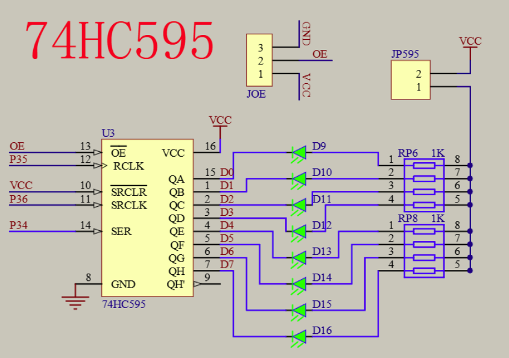
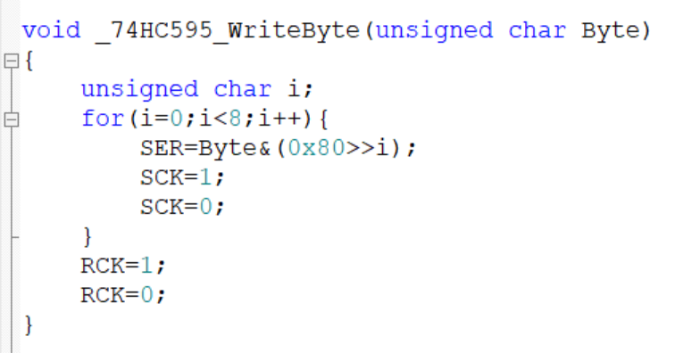

# day08

今天的内容是LED点阵屏

## 9-1 LED点阵屏显示图形

[源码跳转](code\day08\9-1\main.c)

LED点阵屏其实和数码管的显示有点像，LED点阵屏就是8个i/o口表示行，8个i/o口表示列，用8*8的矩阵来确定哪个灯亮但同样只能同时亮一行或一列，所以一样使用扫描的方式来显示图像，再来讲一下74HC595寄存器，要点亮LED点阵屏固然可以一个一个点亮，但是效率低，所以这里使用74HC595寄存器来优化效率，74HC595寄存器可以用3个i/o口来输出8位二进制刚好符合LED点阵屏一行或一列要点亮的灯，这里讲一下74HC595寄存器的原理，看电路图可以得知主要的三个i/o口是RCLK，SRCLK，SER，这个有点像c语言的栈，SER输出一个信号到最底下，SECLK决定下一个信号的输入，当8位满了之后RCLK输出信号来输出这8位二进制，看代码的_74HC595_WriteByte也可以看出这个逻辑，然后呢就是注意消影，其他代码就不具体讲了。

## 9-2 LED点阵屏显示动画

[源码跳转](code\day08\9-2\main.c)

显示动画其实跟显示图像一样只不过是一张一张图片拼凑出来的，动画的数据可以用软件一键生成，然后就是用之前的代码来显示，建议先把之前代码模块化再写动画，具体代码我就不分析了。