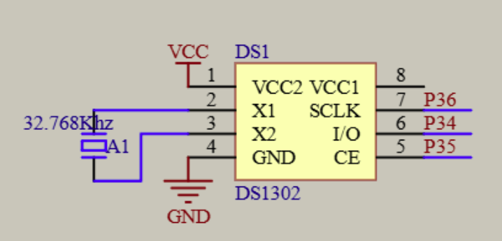
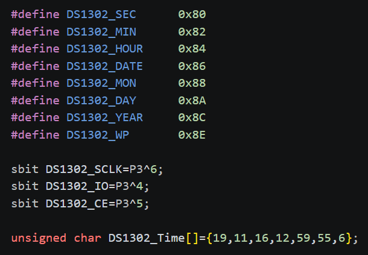
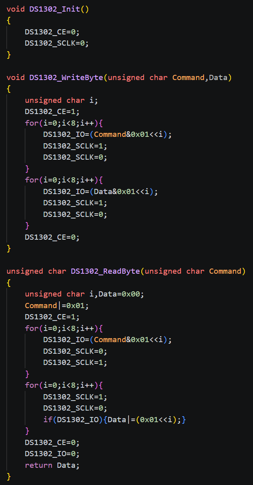
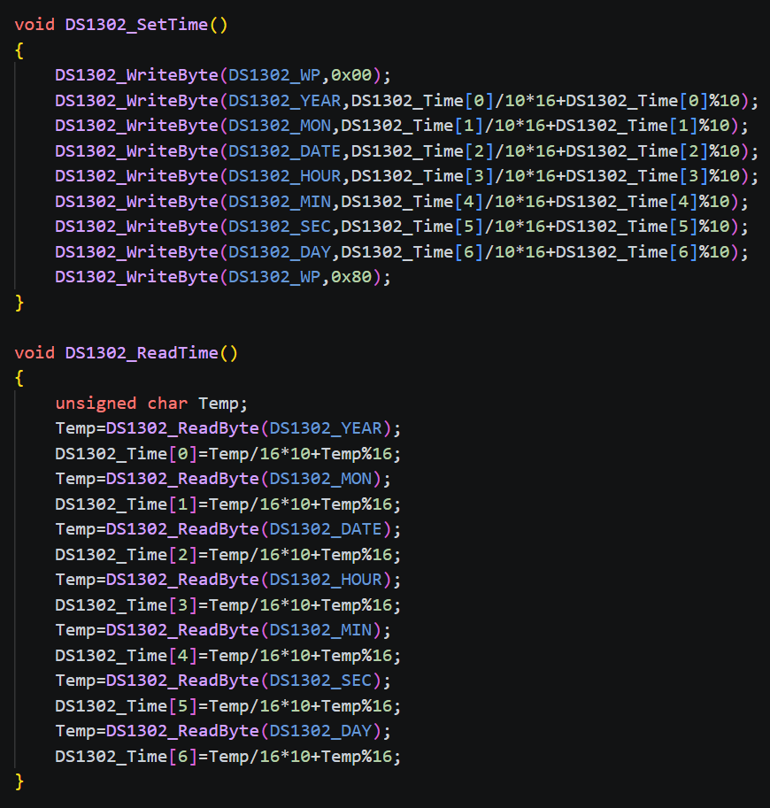
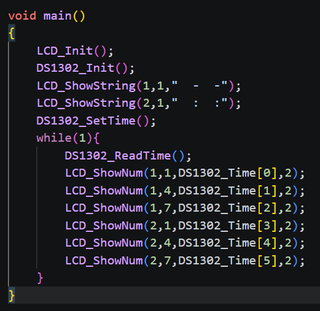

# day09

今天的内容是DS1302时钟

## 10-1 DS1302时钟

[源码跳转](code\day09\10-1\main.c)

DS1302时钟是有自己的晶振频率的集成电路，由电路图可知频率为32.748KHz,这是标准时钟频率，DS1302时钟就是用这个频率计算时间的，现在来讲讲DS1302时钟的时序定义，首先会有CE引脚输出高电平，这说明要对DS1302时钟进行读出或者写入操作，然后SCLK会输出命令字，这个命令字会包含都还是写的逻辑，如果是写就继续发送8位二进制表示写入的数据，如果是读就是i/o口会输出对应数据MCU来读这个i/o口获取数据，接下来写一下代码

首先重定义一下各个命令字，部分引脚这样方便后续使用，再定义一个时间数组。

使用DS1302需要确保DS1302_CE=0;DS1302_SCLK=0;所以写一个DS1302_Init用于初始化，DS1302_WriteByte就是用于写入命令字和数据，DS1302_ReadByte是用于写入读取命令字和接收数据，这里主要注意io和ce高低电平的设置不能弄错。

DS1302_SetTime就是将时间数组写入DS1302时钟中，因为这是数组使用的是16进制所以将数组中的数据转换为10进制后再写入，DS1302_ReadTime就是读取DS1302时钟中的时间，将数据转换为16进制后再写入时间数组中。

主函数就只需要读取后用LCD_ShowNum将时间显示出来即可。

## 10-2 DS1302可调时钟

[源码跳转](code\day09\10-2\main.c)

可调时钟就是运用之前学过的独立键盘来控制时钟的时间，我这里就不一一分析代码了，具体直接看源码即可。