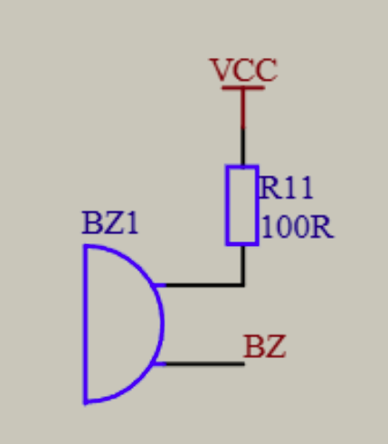

# day10

今天的内容是蜂鸣器

## 11-1 蜂鸣器播放提示音

[源码跳转](code\day10\11-1\main.c)

先来讲一下蜂鸣器的原理，从电路图就可以看出，蜂鸣器是一个简单的电阻-电容-三极管电路，当三极管导通时，蜂鸣器会发出声音，那么怎么控制发出不同的音调呢，其实就是通过控制器提供不同震荡脉冲的频率来发出不同频率的声音，这里我就不详细讲解代码了，都比较简单没有难的

## 11-2 蜂鸣器播放音乐

[源码跳转](code\day10\11-2\main.c)

播放音乐其实就是排列各个不同频率的声音和播放时长来达成音乐的效果，这里结合乐谱就能写出一首歌，源码已经写好了模板，我就不详细讲了