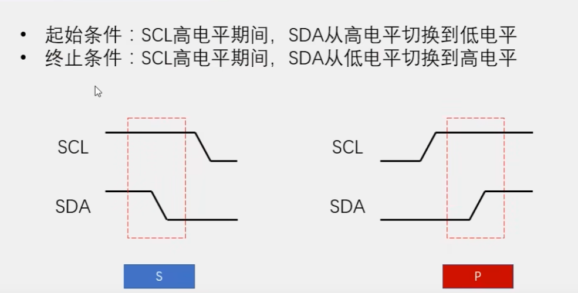
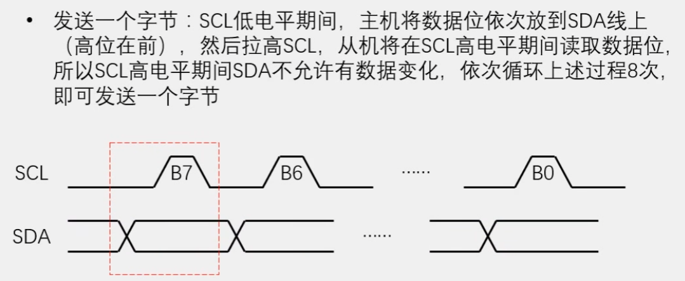
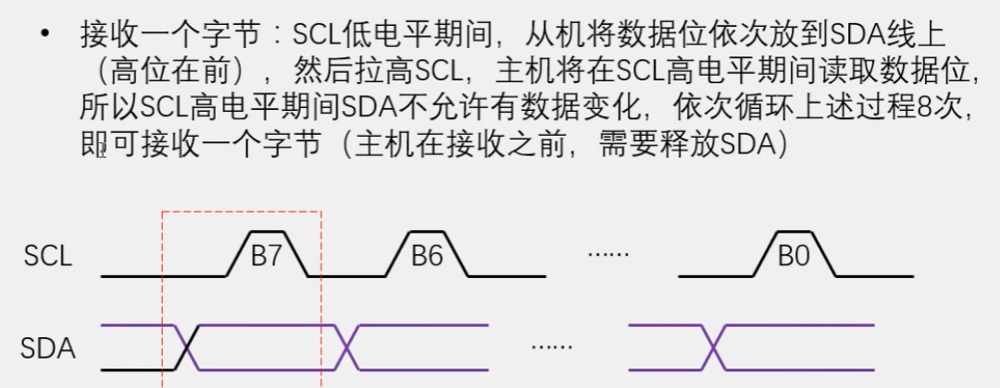
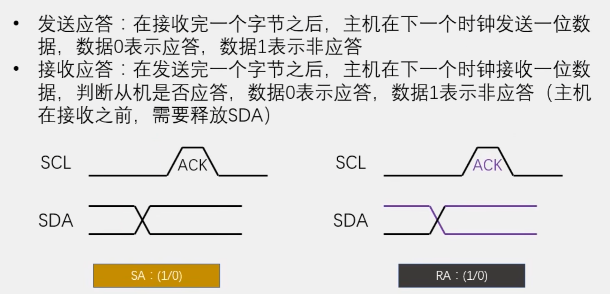

# day11

今天的内容是AT24C02(I2C总线)

## 12-1 AT24C02数据存储

[源码跳转](code\day11\12-1\main.c)

这里先来讲一下AT24C02，这是一种实现掉电不丢失的存储器，这里主要讲一下处理器如何与AT24C02进行通信，要写数据首先会发送7位地址加一位写操作位，然后AT24C02会响应接收应答给处理器，处理器收到后会继续发送8位数据并等待AT24C02的接收应答，AT24C02每接收8位数据都会发送接收应答来使处理器发送下个8位数据，读的流程也一样，7位地址加一位读操作位，处理器每接收8位AT24C02的数据发送一次接收应答来使AT24C02发送下个8位数据，这样就实现了在AT24C02中读写的操作，至于开始、结束、发送、接收、应答的电平图都在图中，接下来讲一下代码

I2C.h里面呢就是实现开始、结束、发送、接收、应答的电平控制，这样最基本的通信就完成了，AT24C02.h内写了用I2C的函数来进行发送和接收数据，需要注意的是存储完数据后要延时5ms，因为写入最长时间需求就是5ms，我这里就不详细讲代码了，跟着图理一遍电平逻辑就行

## 12-2 AT24C02实现秒表

[源码跳转](code\day11\12-2\main.c)

代码部分我就不全讲了，主要讲一下关于定时器复用的的部分，定义多个T0Count使每个定时器都能独立计时，这样就可以实现多个代码定时工作且不占用主线程，但需要注意定时函数这里不能执行例如delay这种长时间函数，否则大概率出问题，代码我就讲这些，详细还是看具体代码吧

