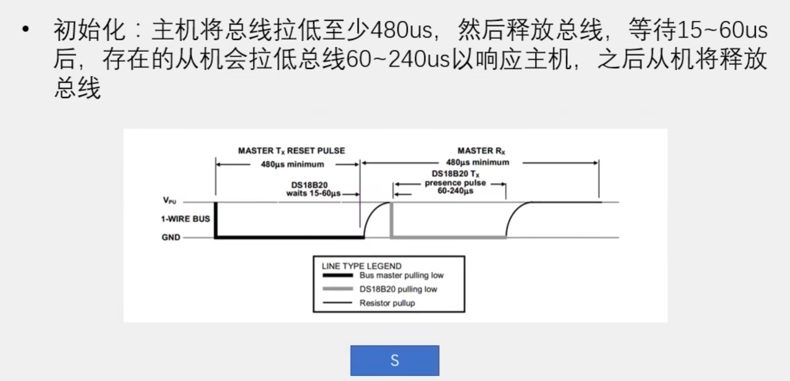
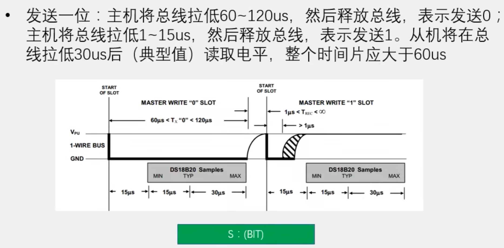
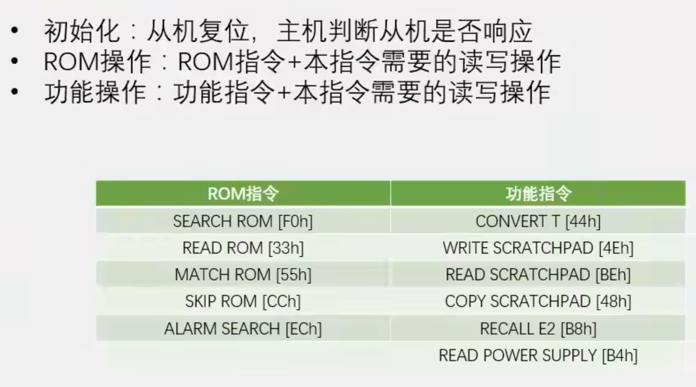

# day12

今天的内容是DS18B20温度传感器

## 13-1 DS18B20温度读取

[源码跳转](code\day12\13-1\main.c)

以上是DS18B20温度的时序图，具体结合代码我就不详细讲了，还有一张图呢是DS18B20的指令码，我使用宏定义的方式来便于使用这些指令码

读出来的温度有正负号和小数所以选择使用float类型来存储温度，这里需要注意对小数的处理先*10000再对10000取余就可以得到小数部分别忘了对*10000的部分做强制长整型转换，否则会丢失精度，差不多这样代码部分需要注意的就没了，其他我就不讲了。

## 13-2 DS18B20温度报警

[源码跳转](code\day12\13-2\main.c)

这个就是结合之前学习的代码来实现用独立按钮设定温度的上下限来判断温度的高低，需要注意独立按键用之前的定时器来实现，避免按键按下时DS18B20无法读出温度，同时看OneWire里由于延时时间属于微秒级别，定时器的打断会影响温度的读取，所以这里选择当读取时禁用定时器，也就因为这里独立按键对时序的要求不高所以给出的解决方法，如果有更高的要求或许增加外设会是一个好选择，其他的具体看代码吧