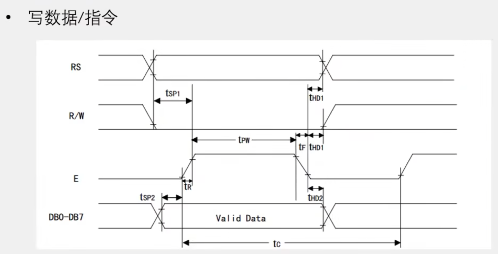
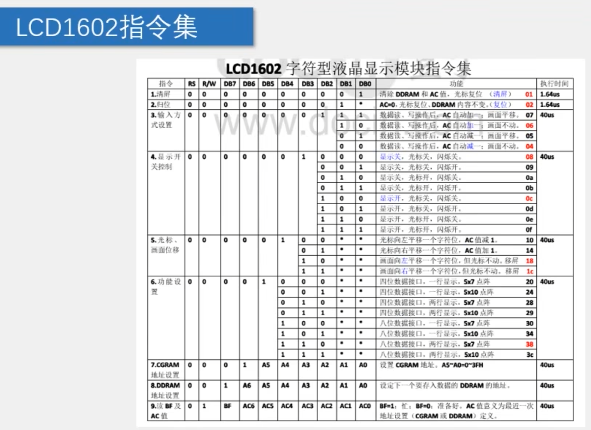
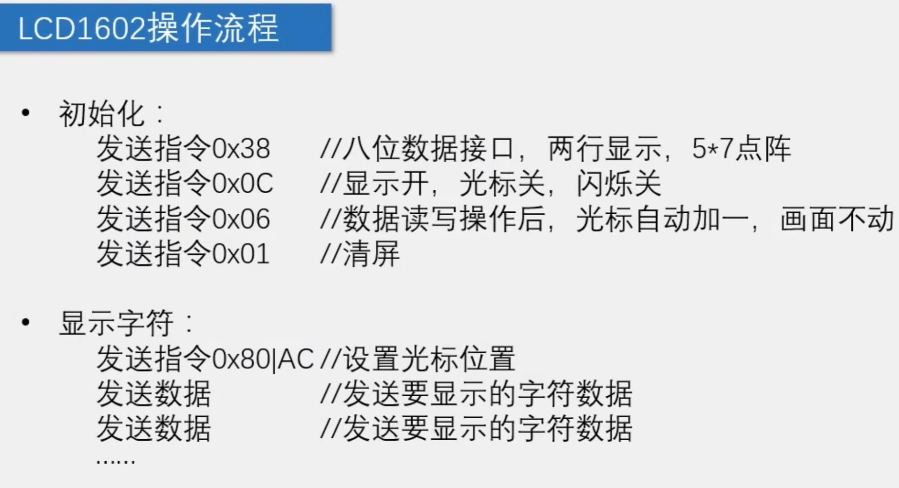

# day13

今天的内容是LCD1602

## 14-1 LCD1602功能函数代码

[源码跳转](code\day13\14-1\main.c)

LCD1602之前就已经用了不少，但一直使用的是别人写好的代码，今天来自己写一个，简单来说就是按照时序图发送对应指令来实现对LCD1602的控制，指令集和操作流程也都给出图片了，对着代码就很容易理解了。这里说一下注意的几点，在写指令和写数据时别忘记延时，对于不同进制的数需要对应的转换，然后呢其实LCD1602屏幕虽然只有16\*2但其实数据显示区是40\*2，所以这里我们可以多存入数据再结合屏幕移动的指令来使数据显示区的数据完全显示，需要补充的点就这些。