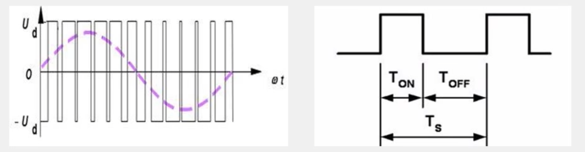
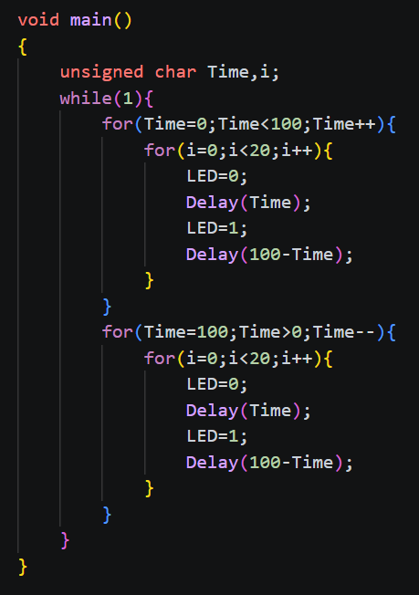
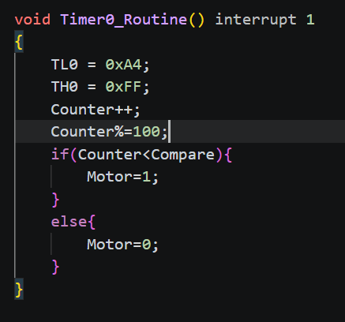

# day14

今天的内容是直流电机驱动(PWM)

## 15-1 LED呼吸灯

[源码跳转](code\day14\15-1\main.c)

这里先来讲讲PWM，PWM是脉冲调制，是指在固定时间周期内，通过改变脉冲的宽度来实现对模拟信号的模拟。这个的作用就是实现灯光亮度和电机转速，这个原理就是通过改变同一周期内通电时间来实现点电流的中间值，这里我们直接来看到代码

以100时刻为周期，电流通过的时间随时间增长，于是LED就能实现亮度随时间变亮的效果，熄灭的原理也一样，这里不再赘述，这样就实现了LED呼吸灯。

## 15-2 直流电机调速

[源码跳转](code\day14\15-2\main.c)

上面我们实现了LED呼吸灯，这里我们来实现直流电机的调速，调速一样就是让占空比变化来实现转速的中间值，直接来看到代码，这里我们用定时器来实现PWM防止其一直占用主线程，把定时器时间设定为100微妙，Compare就是占空比，Counter就是时间刻，Counter< Compare就是要通电的时间，这样就让周期内的占空比通过Compare来控制，然后用按键绑定不同的Compare就行，其他代码就不详细讲了。